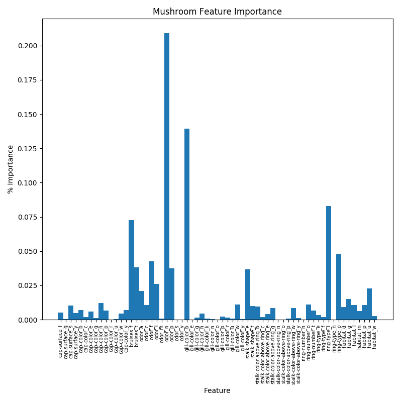

## Mushroom Classification

#### Data

This data was acquired through [Kaggle](https://www.kaggle.com/)'s open source data
program. It is complete with 22 different features of mushrooms along with the classification
of poisonous or not.

#### Methods

I worked to find the best machine learning model to classify the data based on the
provided features. My highest model performance came from a simple OOB Decision
Tree Classifier. I used accuracy to score this model as my classes were fairly evenly
balanced and accuracy is easily communicable to those without a statistics background.
Since all of the features are categorical, I created dummies for each one in order
to train my model.

Initially the RF classifier produced 100% accuracy when training and testing on the
complete feature matrix. I then began to take out features that I believed are not
easily identifiable by the average individual when seeing a mushroom in the wild.
Eliminating a large amount of features, I maintained an accuracy of essentially 100%.

#### Results

Looking into the feature importances of my model, it was learned that odor, bruising,
ring type, and gill color are critical to the success of my model. I believe all of these are fairly
easy to identify in the wild. This would allow me to create a simple app in the future
to be used by individuals to identify certain mushrooms. The feature importances of
my final model are displayed in the graph below.

#### Future Exploration

As mentioned above, the grand goal of this project would be to implement an app in
order to accurately identify poisonous mushrooms in the wild. I would like to also
attempt to label the variety of each mushroom based on the information provided. My final
goal is to then allow image classification, although this would require a completely
different data set and it would be unable to rely on features such as odor.
